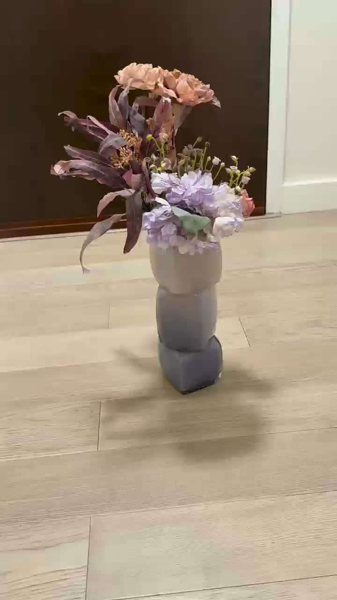
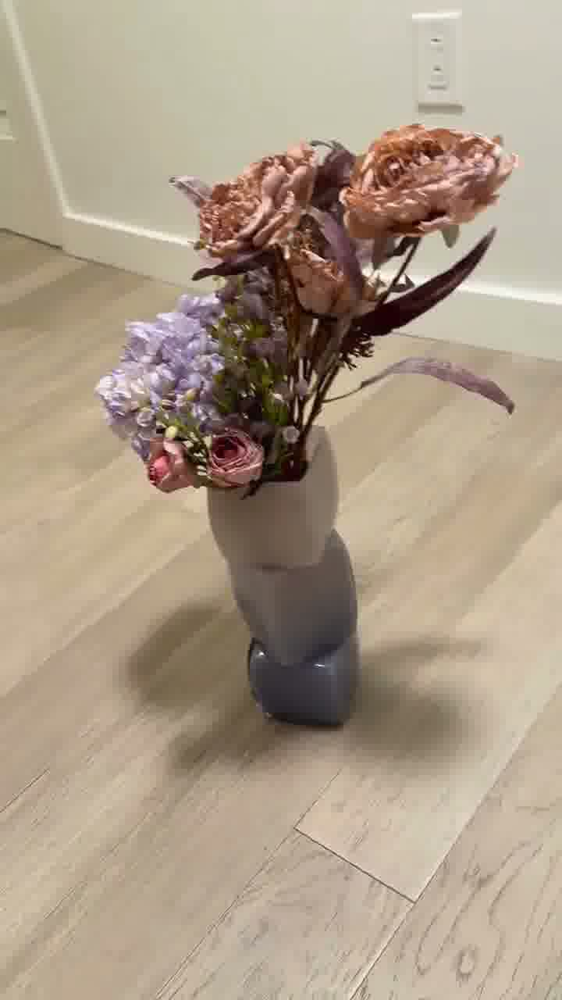
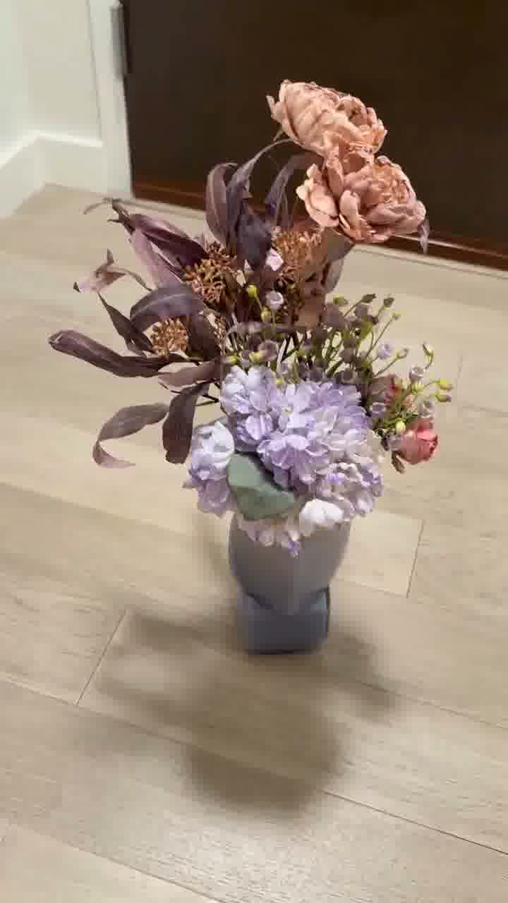
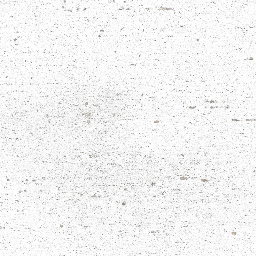
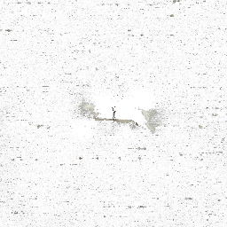
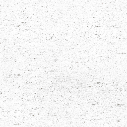

# Video-to-NeRF 3D Reconstruction of a Vest

Portfolio page: https://prenda312.github.io/Yujie-website/#projects

Project repository: https://github.com/Prenda312/vest-nerf-3d-reconstruction

This project reconstructs a neural 3D representation of a vest from a short monocular video. The workflow extracts frames from the video, estimates camera poses with COLMAP, trains a NeRF model with NVIDIA Instant-NGP, and exports visual slice data for inspection.

The original experiment was developed in `C:\Users\Lenovo\Desktop\P2`. This repository keeps the project lightweight and reproducible by tracking documentation, helper scripts, metadata, and a few representative sample images instead of committing multi-GB reconstruction artifacts.

## Project Highlights

- Input: single handheld video of a vest object
- Frame extraction: 215 usable RGB frames in the final dataset
- Pose estimation: COLMAP sparse reconstruction
- Neural reconstruction: Instant-NGP NeRF training
- Output artifacts: trained `.ingp` snapshot, RGBA slice images, raw volume exports
- Optional extension: 3D Gaussian Splatting pipeline prepared for future training

## Pipeline

```text
vest.mp4
  -> extract frames
  -> COLMAP feature matching and sparse reconstruction
  -> transforms.json camera pose conversion
  -> Instant-NGP NeRF training
  -> trained snapshot and volume/slice exports
```

## Repository Layout

```text
assets/
  sample_frames/      Representative input frames
  sample_slices/      Representative exported RGBA volume slices
docs/
  experiment_log.md   Summary of the local experiment and observed outputs
scripts/
  extract_frames.ps1  Helper for extracting frames from a video
  run_colmap.ps1      Reference COLMAP command sequence
  train_instant_ngp.ps1
  export_notes.md     Notes for exporting results from Instant-NGP
.gitignore
README.md
```

## Sample Input Frames

| Early frame | Middle frame | Late frame |
| --- | --- | --- |
|  |  |  |

## Sample Exported Slices

| Slice 0 | Slice 128 | Slice 255 |
| --- | --- | --- |
|  |  |  |

## Local Artifacts Not Tracked in Git

The full local run produced large files that should be stored outside normal Git history or uploaded as release assets / Git LFS files if needed:

| Artifact | Local path | Purpose |
| --- | --- | --- |
| Source video | `C:\Users\Lenovo\Desktop\P2\vest.mp4` | Raw monocular video |
| COLMAP database | `C:\Users\Lenovo\Desktop\P2\instant-ngp\colmap.db` | Feature database and matches |
| Camera poses | `C:\Users\Lenovo\Desktop\P2\instant-ngp\transforms.json` | Instant-NGP camera pose file |
| NeRF snapshot | `C:\Users\Lenovo\Desktop\P2\instant-ngp\data\vest3\base.ingp` | Trained Instant-NGP model snapshot |
| RGBA slices | `C:\Users\Lenovo\Desktop\P2\instant-ngp\data\vest3\rgba_slices` | Exported volume visualization slices |
| Raw volume data | `C:\Users\Lenovo\Desktop\P2\vest\volume_raw` | Large 256x256x256 raw volume exports |

## Reproducing the Workflow

Install these tools first:

- FFmpeg for frame extraction
- COLMAP for structure-from-motion
- NVIDIA Instant-NGP with CUDA support

Then run the pipeline in stages:

```powershell
.\scripts\extract_frames.ps1 -VideoPath "path\to\vest.mp4" -OutputDir "data\vest3"
.\scripts\run_colmap.ps1 -ImageDir "data\vest3" -WorkspaceDir "colmap_workspace"
.\scripts\train_instant_ngp.ps1 -InstantNgpExe "path\to\instant-ngp.exe" -TransformsJson "transforms.json"
```

The exact paths depend on where Instant-NGP, COLMAP, and the extracted frames are installed on the machine.

## Results

The final local dataset used 215 frames at 720 x 1280 resolution. COLMAP successfully estimated camera poses, producing an Instant-NGP-compatible `transforms.json`. Instant-NGP training produced a `base.ingp` snapshot and 256 exported RGBA slices for visual inspection.

## Limitations

- The reconstruction depends heavily on the quality of handheld video coverage.
- Textureless or reflective fabric regions may reconstruct less sharply.
- The current GitHub version stores only sample visual evidence, not the full heavy training outputs.
- Gaussian Splatting code was cloned locally, but no final Gaussian Splatting model artifact was found in the inspected project directory.

## Future Work

- Add a short rendered turntable video of the trained NeRF.
- Train and compare a 3D Gaussian Splatting model on the same frame set.
- Add quantitative reconstruction notes such as frame coverage, COLMAP registered image count, and visual failure cases.
- Store large artifacts through GitHub Releases or Git LFS.
